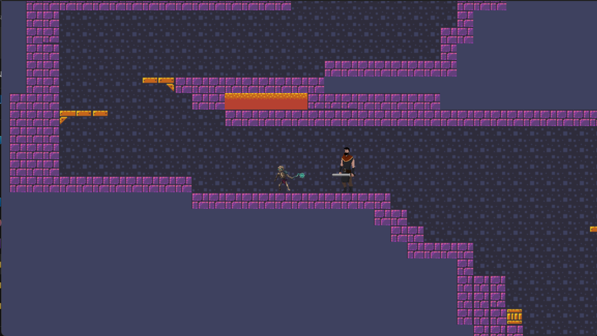
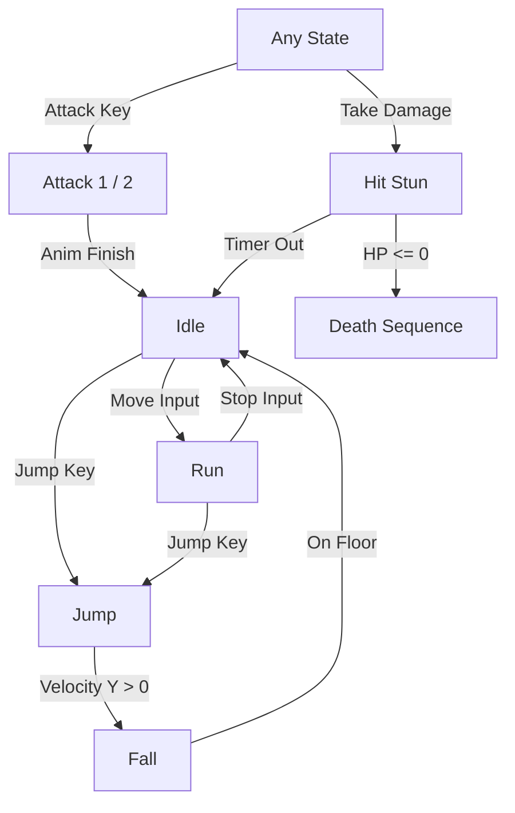
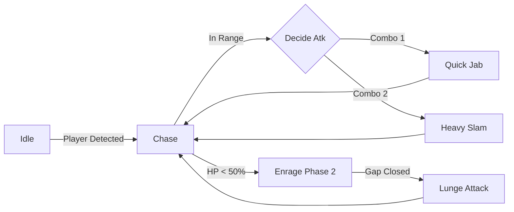

<div align="center">
  <h1>⚔️ Irrumbu Kottaai Pallupudingi ⚔️</h1>
  <h3><i>A Premium 2D Action-Platformer Experience</i></h3>
  <br>
  
  <br><br>
  <p>
    
    
  </p>
</div>

---

## 📜 Project Overview
**Irrumbu Kottai Pallupudingi** is a high-octane 2D action platformer built with Godot. It features responsive character controls, challenging AI enemies, and an epic multi-phase boss fight. This README serves as an interactive technical walkthrough of the core algorithms and game workflows. Use the interactive sections below to expand and explore the logic under the hood!

<details>
<summary><b>✨ View Aesthetic Highlights</b></summary>
<br>

* 🎨 **Gradients & Polish:** Every character UI uses dynamic shaders and HSL-tailored health bars.
* 💧 **Liquid UI:** Death screens and menus feature smooth tweens and fade transitions.
* ✨ **Micro-Animations:** Skeleton enemies "respawn" with a custom animation before entering their AI loop.

</details>

---

## 🏃‍♂️ Combat & Mechanics Algorithms

<details open>
<summary><b>🛡️ Heroic Player Movement & Combat (<code>player.gd</code>)</b></summary>
<br>
The player uses a <strong>Velocity-Based Responsive Movement</strong> algorithm. It prioritizes "tightness" for precise platforming.

<p align="center">
  
</p>

*   **Responsive Input:** Movement is calculated by mapping input axes directly to velocity.
*   **Physics-based Jumping:** Uses a constant `JUMP_VELOCITY` with gravity integration for a natural parabolic arc.
*   **State-Locked Transitions:** Movement is automatically restricted during attack frames or hit-stun for gameplay weight.

```gdscript
# Core Horizontal Movement Algorithm
var dir := Input.get_axis("ui_left", "ui_right")
if not is_attacking and not is_hit:
    if dir != 0:
        velocity.x = dir * SPEED        # Instant acceleration
    else:
        velocity.x = move_toward(velocity.x, 0.0, SPEED * 8.0 * delta) # Friction
```

### 🎯 Interactive Player Logic Workflow

</details>

---

## 🧠 Dynamic Enemy AI 

<details>
<summary><b>💀 Kuttykunjan: The Skeletal Sentinel (<code>kuttykunjan.gd</code>)</b></summary>
<br>
The skeleton utilizes a **Patrol & Chase Finite State Machine**.

*   **Wander Logic:** Selects a random target coordinate within a set radius and moves at `roam_speed`.
*   **Detection Fallback:** If the `Area2D` detection fails, a proximity-based distance check triggers the **Chase** state.
*   **Attack Pacing:** Uses a cooldown-based trigger to ensure fire-rate balance.
</details>

<details open>
<summary><b>👹 The Dark Lord: Main Boss AI (<code>mainboss.gd</code>)</b></summary>
<br>
The boss implements a <strong>Predictive Pattern AI</strong> with an escalating difficulty curve.

<div align="center">
  
  
</div>

*   **Phase Transition:** Automatically enters **Phase 2 (Enraged)** at < 50% HP, increasing speed by 60%.
*   **Combo System:** Tracks hit counts to cycle between a quick jab (Atk 1) and a heavy slam (Atk 2).
*   **Lunge Mechanic:** In Phase 2, the boss calculates a vector towards the player and executes a high-velocity dash if the player attempts to keep distance.

### 🎭 Boss Encounter Logic Flow

</details>

---

<br>

> [!TIP]
> **Pro Tip for Presentation:** Open `project.godot` and run the game directly from the `main` scene. The Boss AI is tuned to be difficult—use **Attack 2** (<kbd>G</kbd>) for heavy damage!

> [!IMPORTANT]
> This project follows the **DRY (Don't Repeat Yourself)** principle, using a centralized group-based damage handling system (`add_to_group("enemy")`).

<div align="center">
  <br>
  <i>Made with ❤️ for the Gameathon 2026</i>
</div>
