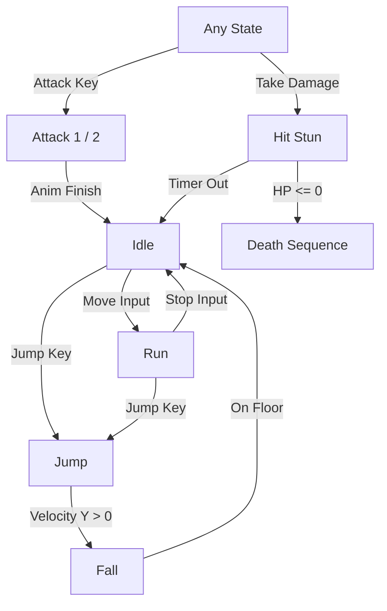
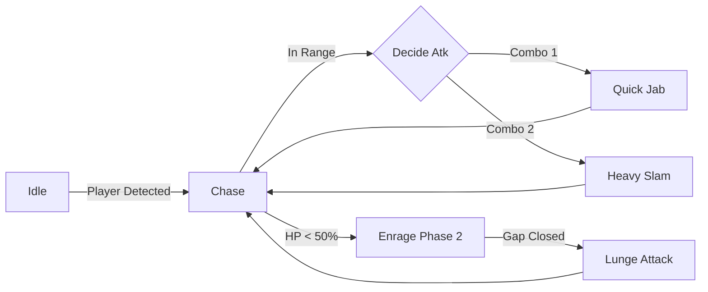

# ⚔️ Irrumbu Kottai Pallupudingi ⚔️
### *A Premium 2D Action-Platformer Experience*


---

## 📜 Project Overview
**Irrumbu Kottai Pallupudingi** is a high-octane 2D action platformer built with Godot. It features responsive character controls, challenging AI enemies, and an epic multi-phase boss fight. This README serves as a technical walkthrough of the core algorithms and game workflows.

---

## 🏃 Character Movement Algorithms

### 1. Heroic Player Movement (`player.gd`)
The player uses a **Velocity-Based Responsive Movement** algorithm. It prioritizes "tightness" for precise platforming.

*   **Responsive Input:** Movement is calculated by mapping input axes directly to velocity.
*   **Physics-based Jumping:** Uses a constant `JUMP_VELOCITY` with gravity integration for a natural parabolic arc.
*   **State-Locked Transitions:** Movement is automatically restricted during attack frames or hit-stun for gameplay weight.

```gdscript
# Core Horizontal Movement Algorithm
var dir := Input.get_axis("ui_left", "ui_right")
if not is_attacking and not is_hit:
    if dir != 0:
        velocity.x = dir * SPEED        # Instant acceleration
    else:
        velocity.x = move_toward(velocity.x, 0.0, SPEED * 8.0 * delta) # Friction
```

### 2. Kuttykunjan: The Skeletal Sentinel (`kuttykunjan.gd`)
The skeleton utilizes a **Patrol & Chase FSM (Finite State Machine)**.

*   **Wander Logic:** Selects a random target coordinate within a set radius and moves at `roam_speed`.
*   **Detection Fallback:** If the `Area2D` detection fails, a proximity-based distance check triggers the **Chase** state.
*   **Attack Pacing:** Uses a cooldown-based trigger to ensure fire-rate balance.

### 3. The Dark Lord: Main Boss (`mainboss.gd`)
The boss implements a **Predictive Pattern AI** with an escalating difficulty curve.

*   **Phase Transition:** Automatically enters **Phase 2 (Enraged)** at < 50% HP, increasing speed by 60%.
*   **Combo System:** Tracks hit counts to cycle between a quick jab (Atk 1) and a heavy slam (Atk 2).
*   **Lunge Mechanic:** In Phase 2, the boss calculates a vector towards the player and executes a high-velocity dash if the player attempts to keep distance.

---

## 🔄 Dynamic Workflows (State Machines)

### Player Logic Workflow


### Boss AI Logic Workflow


---

## 🎨 Visual Presentation Highlights
*   **Gradients & Polish:** Every character UI uses dynamic shaders and HSL-tailored health bars.
*   **Liquid UI:** Death screens and menus feature smooth tweens and fade transitions.
*   **Micro-Animations:** Skeleton enemies "respawn" with a custom animation before entering their AI loop.

---

> [!TIP]
> **Pro Tip for Presentation:** Open the `project.godot` and run the game directly from the `main` scene. The Boss AI is tuned to be difficult—use the "Attack 2" (G Key) for heavy damage!

> [!IMPORTANT]
> This project follows the **DRY (Don't Repeat Yourself)** principle, using a centralized group-based damage handling system (`add_to_group("enemy")`).

---

*Made with ❤️ for the Gameathon 2026*
